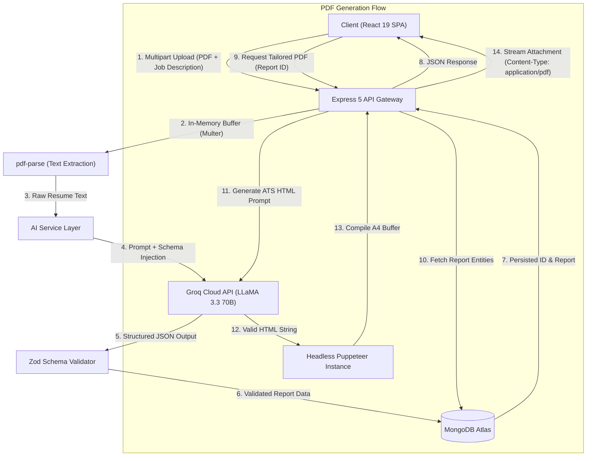

# 🎯 AI Resume & Interview Prep Platform

An enterprise-grade, full-stack career acceleration platform designed to bridge the gap between candidate resumes and modern job requirements. The application parses candidate resumes, benchmarks qualifications against target job descriptions using **LLaMA 3.3 (70B) via Groq Cloud**, performs automated skill-gap analysis, generates structured 7-day interview roadmaps, and dynamically compiles tailored, ATS-compliant HTML/PDF resumes through headless Chromium automation.

---

## 📑 Table of Contents
- [1. Project Overview](#1-project-overview)
- [2. Tech Stack](#2-tech-stack)
- [3. System Architecture & Core Data Flow](#3-system-architecture--core-data-flow)
- [4. The Reality Check: Limitations, Trade-offs & Technical Debt](#4-the-reality-check-limitations-trade-offs--technical-debt)
- [5. Senior Engineer Interview Prep & System Design Guide](#5-senior-engineer-interview-prep--system-design-guide)
- [6. Local Setup & Installation](#6-local-setup--installation)

---

## 1. Project Overview

### Problem Statement
Job applicants frequently face two distinct barriers in the recruitment pipeline:
1. **Applicant Tracking System (ATS) Disqualification:** Resumes fail to pass parsing algorithms due to mismatched terminology or formatting anomalies.
2. **Generic Interview Preparation:** Candidates lack objective evaluation of their skill deficiencies relative to specific job requirements.

### Solution
This platform automates technical alignment by:
- Ingesting raw resume documents (`.pdf`) via in-memory stream processing.
- Extracting text and synthesizing it with candidate self-descriptions and target Job Descriptions (JDs).
- Leveraging high-throughput LLM inference with strict JSON schema enforcement (**Zod**) to output deterministic match metrics, domain-specific technical questions, situational behavioral questions, and actionable remediation plans.
- Rendering customized, ATS-optimized PDF resumes on-demand utilizing **Puppeteer**.

---

## 2. Tech Stack

| Domain | Technology | Description |
| :--- | :--- | :--- |
| **Frontend** | **React 19**, **Vite 8** | Single Page Application (SPA) architecture with fast HMR |
| | **React Router v7** | Client-side routing with guarded authentication wrappers |
| | **Sass (SCSS)** | Component-scoped modular styling |
| | **Axios** | HTTP client with automatic credential propagation |
| **Backend** | **Node.js** & **Express 5** | RESTful API server with modular route/controller layer |
| | **Multer** | In-memory binary multipart file buffer management |
| | **pdf-parse** | Low-latency binary PDF text stream extraction |
| | **Puppeteer** | Headless Chromium browser automation for PDF rendering |
| **AI / LLM** | **Groq Cloud SDK** | Sub-second inference powered by LPU hardware |
| | **LLaMA 3.3 70B Versatile** | Foundation model for candidate evaluation and resume generation |
| | **Zod** | Runtime type validation and schema contract enforcement |
| **Database** | **MongoDB Atlas** & **Mongoose 9** | Document-oriented persistence with ODM schema modeling |
| **Security** | **JWT (JSON Web Tokens)** | Stateless session management |
| | **Bcrypt.js** | Salted cryptographic password hashing |
| | **HTTP-Only Cookies** | Secure `SameSite=None; Secure=true` cross-domain auth tokens |
| **DevOps** | **Vercel** & **Render** | Decoupled deployment architecture with automated CI/CD |

---

## 3. System Architecture & Core Data Flow



### End-to-End Execution Breakdown

1. **Intake & Extraction:** The frontend dispatches a `multipart/form-data` payload containing the target job description, candidate self-description, and raw resume file. Multer intercepts the stream into a transient memory buffer (`3MB` ceiling), passing the buffer directly to `pdf-parse` without disk I/O overhead.
2. **AI Inference & Structured Output Guarantee:** The parsed text is synthesized into a standardized system prompt and dispatched to Groq (`llama-3.3-70b-versatile`). The response is constrained via `response_format: { type: "json_object" }` and validated against a runtime **Zod schema** (`interviewReportSchema`) before persisting to MongoDB.
3. **Automated ATS Resume Compilation:** On export, the stored profile is formatted into semantic HTML via LLM prompt engineering, loaded into a headless Chromium page instance via Puppeteer (`--no-sandbox`, `--disable-dev-shm-usage`), and rendered to a print-ready A4 PDF binary stream.

---

## 4. The Reality Check: Limitations, Trade-offs & Technical Debt

In production engineering, every architectural choice involves trade-offs. Here is an honest appraisal of current limitations:

### 1. Synchronous PDF Generation vs. Asynchronous Task Queues
* **Current State:** PDF generation via Puppeteer runs synchronously inside the Express request-response loop.
* **Trade-off:** Under high concurrency (e.g., 20+ simultaneous PDF requests), Chromium processes will spike RAM consumption (~150MB–300MB per instance), potentially triggering Out-Of-Memory (OOM) crashes on low-tier container hosts.
* **Production Fix:** Offload PDF generation to a distributed task queue (**BullMQ** / **Redis**) with dedicated worker nodes or migrate to an AWS Lambda / S3 event-driven architecture.

### 2. In-Memory File Buffers vs. Cloud Object Storage
* **Current State:** Resumes are held strictly in memory buffers (`Multer.memoryStorage()`) and discarded after parsing; only raw extracted text is saved to MongoDB.
* **Trade-off:** Minimal storage costs and high parsing speed, but the original visual formatting and raw file binaries cannot be re-audited or downloaded later.
* **Production Fix:** Stream raw binary uploads directly to an S3-compatible bucket (e.g., AWS S3, Cloudflare R2) before triggering parsing pipelines.

### 3. Cross-Domain Cookie Authentication vs. Authorization Bearer Headers
* **Current State:** Authentication relies on `HttpOnly`, `SameSite=None`, `Secure` cookies across separate origins (Vercel Frontend $\leftrightarrow$ Render Backend).
* **Trade-off:** Protects against XSS token exfiltration, but requires strict third-party cookie support in the client browser (which can be affected by aggressive privacy tracking blockers).
* **Alternative:** Implement Authorization headers (`Bearer <token>`) combined with short-lived tokens and refresh tokens.

### 4. Non-Deterministic LLM Output Resiliency
* **Current State:** If Groq's output deviates from the expected JSON structure or fails Zod parsing, the request throws a `500 Internal Server Error`.
* **Production Fix:** Implement an automated retry mechanism with temperature reduction or fall back to an extraction repair agent.

---

## 5. Senior Engineer Interview Prep & System Design Guide

Use these targeted architectural questions and model answers to master interviews on this codebase:

### Q1: How do you guarantee deterministic, structured JSON output from non-deterministic LLMs, and how do you handle failures?
> **Model Answer:**  
> *"We combine model-level JSON mode with application-level runtime schema validation. At the provider level, we enforce `response_format: { type: "json_object" }` in Groq's completion API to guarantee valid JSON syntax. At the application layer, we validate the parsed payload against a strict **Zod schema** (`interviewReportSchema`) that defines exact data types, nested array boundaries, and required fields. If the LLM generates unexpected keys or violates types, Zod fails fast at runtime before bad data touches the database."*

### Q2: Why did you choose in-memory stream processing with Multer instead of persisting files directly to disk?
> **Model Answer:**  
> *"In a cloud-native, containerized architecture (e.g., Render, Docker, Kubernetes), the local filesystem is ephemeral and writing files to disk causes disk fragmentation, concurrency race conditions, and requires manual garbage collection. By utilizing `multer.memoryStorage()`, we stream the binary file directly into RAM, pass the buffer to `pdf-parse`, extract raw text in milliseconds, and release memory immediately. For a 3MB limit, in-memory buffering provides optimal throughput with zero disk I/O bottlenecks."*

### Q3: What were the architectural challenges with authentication across decoupled domains (Vercel and Render), and how did you resolve them?
> **Model Answer:**  
> *"When the frontend is deployed on Vercel (`vercel.app`) and the backend on Render (`onrender.com`), they operate as third-party cross-origins. Standard cookies are blocked by default. To resolve this:  
> 1. Configured CORS with explicit `origin` reflection and `credentials: true`.  
> 2. Configured session cookies with `httpOnly: true`, `secure: true`, and `sameSite: "none"`.  
> This ensures modern browser security engines accept and send back session cookies on authenticated API calls while remaining protected against XSS-based token theft."*

### Q4: How do you run Headless Chrome (Puppeteer) in containerized Linux environments without crashing?
> **Model Answer:**  
> *"Running headless Chromium in Linux containers presents two challenges: missing shared system libraries and shared memory limitations. We resolve this by:  
> 1. Passing `--no-sandbox` and `--disable-setuid-sandbox` to run within container security contexts.  
> 2. Adding `--disable-dev-shm-usage` to prevent Chromium from crashing when `/dev/shm` shared memory partitions are restricted by container orchestrators.  
> 3. Installing dedicated Chromium binaries during the build phase via `npx puppeteer browsers install chrome`."*

---

## 6. Local Setup & Installation

### Prerequisites
- **Node.js**: `v18.0.0` or higher
- **MongoDB**: Local instance running or MongoDB Atlas connection URI
- **Groq API Key**: Free tier or enterprise key from [Groq Console](https://console.groq.com/)

---

### Step 1: Clone the Repository
```bash
git clone https://github.com/akshay0dkd/ai-resume-assistant.git
cd ai-resume-assistant
```

---

### Step 2: Backend Configuration
1. Navigate to the backend directory:
   ```bash
   cd Backend
   ```
2. Install dependencies:
   ```bash
   npm install
   ```
3. Create a `.env` file in `Backend/`:
   ```env
   PORT=3000
   NODE_ENV=development
   MONGO_URI=mongodb+srv://<username>:<password>@cluster0.mongodb.net/ai-resume
   JWT_SECRET=your_super_secret_jwt_key
   GROQ_API_KEY=gsk_your_groq_api_key_here
   FRONTEND_URL=http://localhost:5173
   ```
4. Start the development server:
   ```bash
   npm run dev
   ```

---

### Step 3: Frontend Configuration
1. Open a new terminal and navigate to the frontend directory:
   ```bash
   cd Frontend
   ```
2. Install dependencies:
   ```bash
   npm install
   ```
3. Create a `.env` file in `Frontend/`:
   ```env
   VITE_API_URL=http://localhost:3000
   ```
4. Start the Vite development server:
   ```bash
   npm run dev
   ```
5. Open your browser and navigate to `http://localhost:5173`.

---

## 📜 License
This project is open-source and licensed under the **ISC License**.
